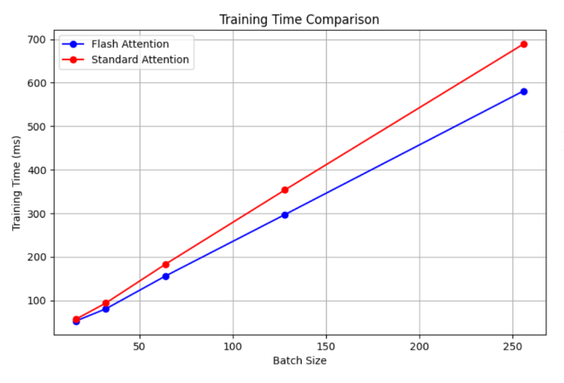

# Efficient-ViT
## Table of Contents

- [Overview](#overview)
- [Milestones](#milestones)
- [Usage](#usage)
- [Results](#results)
- [Conclusion](#conclusion)
- [Contribution](#contribution)

## Overview 
Optimizing Vision Transformers (ViTs) for resource-constrained environments by reducing model size and inference latency while maintaining performance. Implements flash attention, attention head pruning, teacher-student distillation, and quantization, inspired by the Once-for-All approach for CNNs. Combines all the optimization techniques using a simplified Neural Architecture Search given parameter and memory contraints.

Used a ViT patch 16-224 as the base model and implemented image classification on the CIFAR-100 dataset.

## Milestones  

### Flash Attention
Minimized overhead and sped up attention process using Flash Attention.
Reduced computational burden typically associated with ViTs

### Pruning
Implemented attention head pruning using L2 Norm of grouped weights. Network can be pruned iteratively for different pruning ratios and steps giving sparser models

### Teacher Student Distillation
Used the base model given above as teacher and a deit_tiny as the student model. Trained using a combination of KL divergence and cross entropy loss

### Quantization
Quantized all linear layers in the model to int8. Linear layers inclued attention layers which is implemented as 3 linear layers of query, key and value

### Neural Architecture Search
Implemented a simplified Neural Archtecture Search in the defined search space given memory and parameter constraints. Other requirements like target memory or parameters can also be added by modifying the score.

## Usage 

### Data Preparation
The CIFAR-100 dataset if not present in the /data folder, will be automatically downloaded in the python notebook

### Running Experiments

Open and run the jupyter notebooks to interactively run the experiments.
- ViT-FlashAttention.ipynb : Implementation of Pre-training optimizations
- ViT_post_training.ipynb : Implementation of Post-training optimizations

## Results 

The main results are summarized below:

### Flash Attention

| Batch Size | Flash Train Time (ms) | Standard Train Time (ms) | Flash Inference Time (ms) | Standard Inference Time (ms) | Train Speedup (x) | Inference Speedup (x) |
|------------|------------------------|--------------------------|----------------------------|------------------------------|--------------------|-----------------------|
| 16         | 53.038760             | 57.209185               | 29.826680                 | 29.917025                   | 1.078630          | 1.003029             |
| 32         | 80.881161             | 94.161342               | 49.698082                 | 49.633290                   | 1.164194          | 0.998696             |
| 64         | 156.295521            | 183.497359              | 93.735401                 | 93.849544                   | 1.174041          | 1.001218             |
| 128        | 297.264711            | 353.873496              | 177.331204                | 177.867273                  | 1.190432          | 1.003023             |
| 256        | 581.151282            | 689.016176              | 341.334433                | 341.536947                  | 1.185606          | 1.000593             |

### Pruning

| Parameters (M) | Top-1 Accuracy (%) | Top-3 Accuracy (%) |
|----------------|--------------------|--------------------|
| 85.9           | 81.9              | 93.9              |
| 75.8           | 74.5              | 89.8              |
| 74.4           | 73.4              | 89.1              |
| 72.1           | 70.1              | 86.9              |
| 68.9           | 67.2              | 84.7              |
| 63.7           | 56.6              | 75.5              |

### Distillation
- 15 times smaller model gives a 92.5% top-3 accuracy 
- Speedup of 2.9
- 4 times less CPU memory consumed

### Quantization
- 75% reduction in model weights memory
- 55% reduction in CPU inference time calculated using torch profiling

### Neural Architecture Search
- 70M parameter limit
  -  88.7% accuracy
  -  200 sec latency (Test dataset)
  -  25GB memory used
-  5.3M parameter limit
  - 78.5% accuracy
  - 89 sec latency (Test dataset)
  - 5.16GB memory used

## Conclusion 

The implementation of various optimization techniques for Vision Transformers (ViTs) demonstrated significant improvements in model efficiency, both in training and inference. The results validate the effectiveness of these techniques without a significant drop in accuracy

## Contribution

This project was done as a part of NYU's High Perfromance Machine Learning course (Fall 2024) by Akshay Paralikar (ap8235) and Rugved Mhatre (rrm9598).

Thank you!

